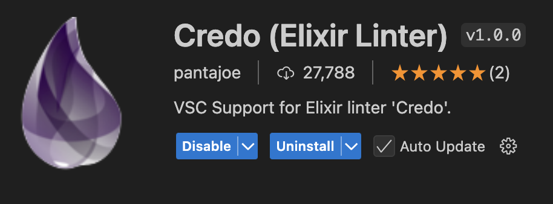
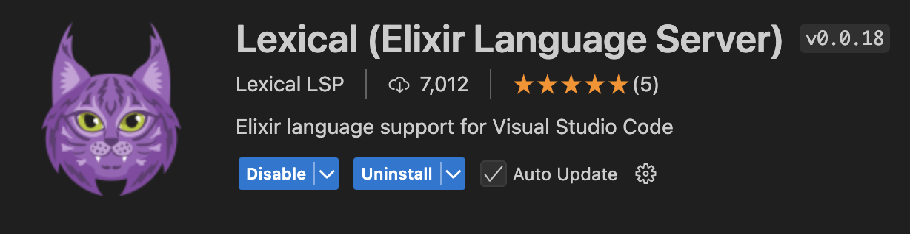
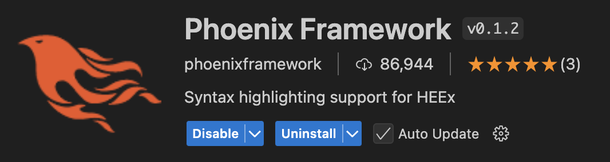
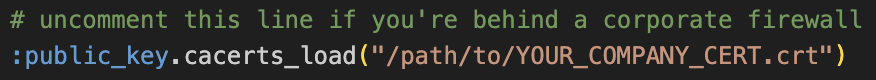
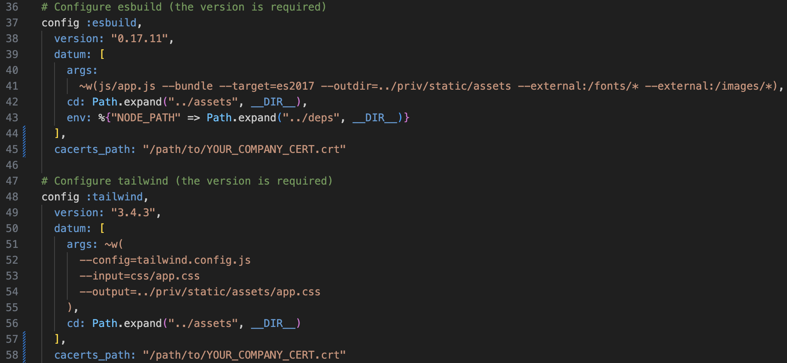

# DeepLynx Elixir Setup

## Requirements

- Elixir 1.17-otp-27 
    - Mac: run `brew install elixir`
    - Windows: Use the appropriate installer found [here](https://elixir-lang.org/install.html#windows). If installing via exe, choose the `Elixir 1.17.3 on Erlang 27` option
- Erlang 27.0 (should come with Elixir installation)
- [Node.js and NPM](https://docs.npmjs.com/downloading-and-installing-node-js-and-npm): used for UI libraries
- Mix (should come with Elixir installation installed)
- **optional**: [asdf](https://asdf-vm.com/guide/getting-started.html): version manager for Elixir, not available on Windows

### VSCode Extensions

Visual Studio Code with a few extensions is primarily recommended as the editor of choice for Elixir/Phoenix. Extensions are available through the extensions tab on the left column of VS Code and typed into the search bar. These extensions help with linting and coding hints to ease the development experience. **Note**: Users of IntelliJ should be aware that there is no support for Phx HEEx templates and that it is recommended to use VSC or at least Zed or Neovim instead. 

- Credo: a static code analysis tool providing code annotations which include best practices and warnings or errors before being compiled to the BEAM. The main extension is by pantajoe. 
- Lexical: the base for the new language server that the Elixir team is funding. 
- Phoenix Framework extension: recommended for the web application. 

## Working Under Enterprise CA (Dealing with Cert Errors)

You will need to add a file for rebar3. If it does not already exist, create the directory ~/.config/rebar3. Then create the file `rebar.config` with the following text modified for the path to your cert. 

`{ssl_cacerts_path, ["/path/to/YOUR_COMPANY_CERT"]}.`

### Modifying Environment Variables

Hex uses an environment variable called `HEX_CACERTS_PATH` set to your certificate bundle. This will resemble the following: 
```sh
export HEX_CACERTS_PATH=/path/to/YOUR_COMPANY_CERT.crt
```
and be added to a .bash_profile or preferred environment variable configuration. Failure to do this will result in an SSL error.

After adding this variable to your profile, be sure to either close and reopen your terminal, or run `source ~/.bash_profile` (replacing bash_profile with your preferred env config file) to load the environment variable into your current terminal.

### Modifying `mix.esx`

Uncomment the top line in the `mix.exs` file and change the path to reflect the path to your cert. 

### Modifying `config/config.exs`

You also need to modify the configuration file in `config/config.exs`, adding `cacerts_path: "/path/to/YOUR_COMPANY_CERT"` to the following lines like so: 

## Server Initialization
1. To run the application, you must first get and compile the dependencies - `mix deps.get && mix deps.compile`.
2. Run `mix setup` this will remove any old databases and rebuild the Operations Sqlite3 database, as well as run its migrations, should cover everything else like fetching sqlite3 and required plugins
    1. You may have to run `brew install coreutils` on Mac if you encounter the following error: `sha256sum: command not found; Checksum fail!`

## Running the CLI
1. Scripts are provided in the `rel` folder for running the various CLI functions. These are bundled into the final release and used as either bash or windows batch scripts to run the relevant command.

## Running the webserver
1. To run the webserver, use the command `mix phx.server`. this should now just....work - no further configuration should be necessary, but be sure to at least peruse `config/dev.exs` which contains relative configuration settings.
2. You will be greeted by a login screen. Instead of registering a new user, for local development it is recommended to use the default admin account:
    - username: `admin@admin.com`
    - password: `xxxxxxxxxxxx` (12 x's)

## Running the tests
To run tests, use the command `mix test`. If all have run correctly, you should see something like the following at the bottom of your terminal:
```
Finished in 1.9 seconds (0.00s async, 1.9s sync)
172 tests, 0 failures
```

## The File Structure
The majority of development will be done in the lib folder with tests written in the aptly named test folder. Within lib, the datum_web folder is where the front-end views as well as their respective controller code reside, in addition to the front end router. The regular datum folder holds backend models and typically hosts business logic and business domain as well as DB interactions. 

## Useful Links

### Documentation

- [Elixir Docs](https://hexdocs.pm/elixir/1.17.3/Kernel.html)
- [Mix Docs](https://hexdocs.pm/mix/1.17.3/Mix.html)
- [Phoenix Docs](https://hexdocs.pm/phoenix/Phoenix.html)
- [LiveView Docs](https://hexdocs.pm/phoenix_live_view/Phoenix.LiveView.html)
- [Flame Docs](https://hexdocs.pm/flame/FLAME.html)

### Guides & Training

- [Elixir Learning](https://elixir-lang.org/learning.html)
- [Exercism Track](https://exercism.org/tracks/elixir)
- [Elixir Koans](https://github.com/elixirkoans/elixir-koans)
- [Pattern Matching in Elixir](https://hexdocs.pm/elixir/pattern-matching.html)
- [Strong arrows blog post: Elixir's path to a type system](https://elixir-lang.org/blog/2023/09/20/strong-arrows-gradual-typing/)
