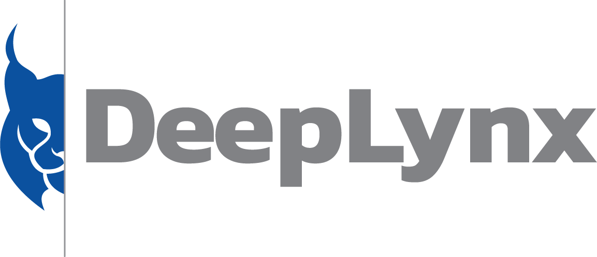

## What is DeepLynx?

DeepLynx is a open-source data warehouse focused on enabling complex projects to embrace digital engineering. It accomplishes bringing digital thread and digital twins to these projects with integrations to a large collection of software systems across a project's lifecycle.

Data is stored in a graph-like format following a user-defined domain ontology. Using the provided GraphQL interface, users and applications can request exactly the data they need by using client side defined queries. This aids finding relationships between complex datasets enabling data science efforts and AI/ML.

## Why Embrace Digital Engineering and DeepLynx?

The construction of megaprojects has consistently demonstrated challenges for project managers in regard to meeting cost, schedule, and performance requirements.

Currently, engineering teams operate in siloed tools and disparate teams. Data connections across design, procurement, construction, and operations systems are translated manually or over brittle point-to-point integrations.

This uncoordinated and disjoint data exchange across these siloes increases the risk of silent errors. These silent errors can cascade across the effort and lead to uncontrollable risk during construction, resulting in significant delays and cost overruns.

DeepLynx is a key tool in solving this problem for megaprojects by bringing those siloed efforts into an integrated platform that operates over the course of a project's lifecycle. DeepLynx integrates to widely used enterprise scale software. The list of software integrations include tools such as Innoslate for systems engineering, IBM's DOORS for requirements management, design tools such as AutoDesk's Revit, and asset management in ABB's AssetSuite.

Leveraging this rich set of integrations allows for projects to efficiently consolidate their data into a cohesive data lake. This data lake provides the foundation for digital thread and digital twin efforts.
## **Documentation**

`DeepLynx` is documented in the following ways

1. [Wiki](https://github.com/idaholab/Deep-Lynx/wiki/Home)
2. API level documentation in the form of an OpenAPI (Swagger) collection - found in the `documentation` folder

## **Installation and Running DeepLynx**

### Docker
___________
The easiest way to get DeepLynx up and running is to use Docker. Docker allows for easily reproducible builds and the majority of configuration tasks and database migrations are handled for you.

1. Install the latest version of Docker
2. Clone the DeepLynx repository
3. Navigate to the DeepLynx repository in your terminal/command line/Powershell
4. Type `docker compose pull` and wait for the process to finish
5. Type `docker compose up --attach deep-lynx` and hit enter
6. To terminate hit Cntrl-C or Cntrl-D

The initial startup might take a while as the operation must first fetch the pre-built containers from the internet. If you need to change any configuration values edit the `.docker-env` file included in your repository


### **Build From Source**
These instructions build out the node.js backend and the UI for DeepLynx. This is recommended if you plan on making changes to the DeepLynx codebase. Otherwise, it may be easier to use the docker instructions above.

#### **Requirements**

-   [node.js](https://docs.npmjs.com/downloading-and-installing-node-js-and-npm) ^16.x
-   [Typescript](https://www.typescriptlang.org/download) ^4.x.x
-   [npm](https://docs.npmjs.com/downloading-and-installing-node-js-and-npm) ^6.x
-   [yarn](https://classic.yarnpkg.com/lang/en/docs/install/) ^3.6.x
-   [Rust](https://www.rust-lang.org/tools/install) ^1.x.x (set to default stable)
-   [Docker](https://docs.docker.com/engine/install/) ^18.x - _optional_ - for ease of use in development

**_Data Persistence Requirements_**

- **Required** - PostgreSQL ^12.x
- **Required** - `pg-crypto` Postgres extension (automatically included with Postgres > 12 and in the Docker images)

You must follow these steps in the exact order given. Failure to do so will cause DeepLynx to either fail to launch, or launch with problems.

1. NodeJS must be installed. You can find the download for your platform here: https://nodejs.org/en/download/ **note** - Newer versions of Node may be incompatible with some of the following commands. The most recent version tested that works fully is 16.13.0 - the latest LTS version.  

2. Clone the DeepLynx [repository](https://github.inl.gov/Digital-Engineering/DeepLynx/tree/main).

3. Navigate to the `server` directory.

4. Run `yarn install` to set up all the node library dependencies.

5. Copy and rename `.env-sample` to `.env`.

6. Update `.env` file. See the `readme` or comments in the file itself for details.

7. Build a dockerized PostgreSQL database:  
     - Ensure Docker is installed. You can find the download here: https://www.docker.com/products/docker-desktop.
     - Windows users:
          - Run `npm run docker:postgres:run` to create and run a docker image containing a Postgres data source.
     - Mac users:
          - Ensure the directory `/private/var/lib/docker/basedata` exists on your machine. If this directory does not exist, please create it (you may need to use `sudo`.
          - Run `npm run mac:docker:postgres:run` to create and run the docker image.  

8. Run `yarn run build` to build the internal modules and bundled administration GUI. **Note** You must re-run this command if you make changes to the administration GUI.

* NOTE: If you are on some sort of encrypted network, you may encounter an error similar to the following when attempting to set up any rust libraries: `warning: spurious network error... SSL connect error... The revocation function was unable to check revocation for the certificate.` This can be solved by navigating to your root cargo config file (`~/.cargo/config.toml`) file and adding the following lines. If you do not have an existing config.toml file at your root `.cargo` directory, you will need to make one:

```
# in ~/.cargo/config.toml
[http]
check-revoke = false
```


9. Run `yarn run watch` or `yarn run start` to start the application. See the `readme` for additional details and available commands. **This command starts a process that only ends when a user terminates with Cntrl+C or Cntrl+D - you will see a constant feed of logs from this terminal once you have started DeepLynx. This is normal.** Changes to the source code of DeepLynx will be captured if you run the application with the `yarn run watch` command.


**Note:** DeepLynx ships with a Vue single page application which serves as the primary UI for the DeepLynx system. You can run this [separately](Administration-Web-App-Installation) (and it's recommended to do so if you're developing it).

**The bundled admin web GUI can be accessed at `{{your base URL}}` - default is `localhost:8090`**
 
### **Configuration**

This application's configuration relies on environment variables of its host system. It is best to rely on your CI/CD pipeline to inject those variables into your runtime environment.

In order to facilitate local development, a method has been provided to configure the application as if you were setting environment variables on your local machine. Including a `.env` file at the projects root and using the `yarn run watch`, `yarn run start`, or any of the `yarn run docker:*` commands will start the application loading the listed variables in that file. See the `.env-sample` file included as part of the project for a list of required variables and formatting help.

### **Database Migrations**

A database migration step takes place each time you launch the application. This ensures that your local database always has the correct schema for your branch.

## **Testing**

This application uses [Mocha](https://mochajs.org/) and [Chai](https://www.chaijs.com/) for its unit and integration tests. Visit their respective websites and documentation to learn more about how to use and develop tests with their platforms.

## **Available Commands**

Below is a list of all `yarn run` commands as listed in the `package.json` file.

- `docker:api:build` Creates a docker image of DeepLynx injecting the .env file for configuration.
- `docker:api:run` Runs previously created DeepLynx image.
- `docker:api:clean` Stops the DeepLynx Docker container run by the command above and deletes the container and image.
- `docker:postgres:build` Creates a Docker image containing a Postgres 12 data source.
- `docker:postgres:run` Runs previously created Postgres image.
- `docker:postgres:clean` Stops the Postgres Docker container run by the command above and deletes the container and image.
- `build` Compiles the application
- `start` Runs the compiled application 
- `watch` Starts the application and rebuilds it each time you make a change to the code. **Note:** this command will not rebuild the bundled Admin Web Application
- `test`: Runs all tests using the `.env` file to configure application and tests **Note:** You must have run the application at least once so that the database migration took place correctly.

**There is a lot more information about DeepLynx, and it's capabilities in its [Wiki](https://github.com/idaholab/Deep-Lynx/wiki/). We highly recommend you start there if you have questions or need to figure out how best to utilize DeepLynx in your project.**
