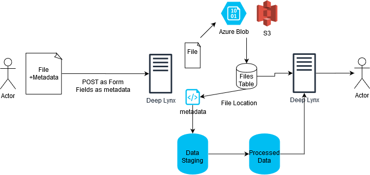

## File Uploading In Deep Lynx
Users can now upload files into the Deep Lynx data warehouse. At time of writing (August 2020) files will either be stored on the local filesystem, or using Azure's Blob Storage service.

Users must configure the `FILE_STORAGE_METHOD` environment variable and set it to be either `azure_blob` or `filesystem`. Users must set additional environment variables with each of the methods, those are described inside the `.env-sample` file at the project's root.

Here is a brief diagram illustrating how file upload and storage works.

1. User POSTS a multipart form to `/containers/:id/datasources/:id/files`. That multipart form can have numerous files and normal field/values attached.
2. Deep Lynx separates the files from the metadata and uploads them to the configured file storage.
3. Deep Lynx creates a record in the `files` table with the files location on the configured storage method and some metadata about the file.
4. If metadata (other fields) were present on the initial POST, Deep Lynx creates an "import" with a single record. That record contains the metadata and file names of all uploaded files. This information then goes through the normal data processing loop.
5. Users can query files directly from the `files` table or via metadata (once its gone through the processing loop)
